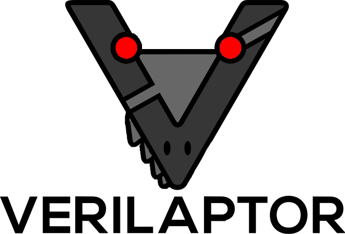

<p align="center">

</p>

For more information read our [blog post](https://research.kudelskisecurity.com/2021/09/21/verilaptor-software-fault-simultation-in-hardware-designs/).

To run AES0 simulation:
```bash
$ verilator -cc aes_192_sed.v -f input.vc --Mdir build -o simu --exe simulation.cpp
$ make -C build/ -f Vaes_192_sed.mk simu
$ ./build/simu
```

To run the full attack:
```bash
$ make
$ ./attack.sh
```
